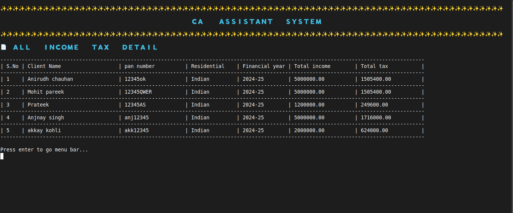
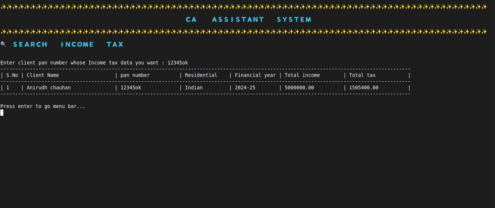
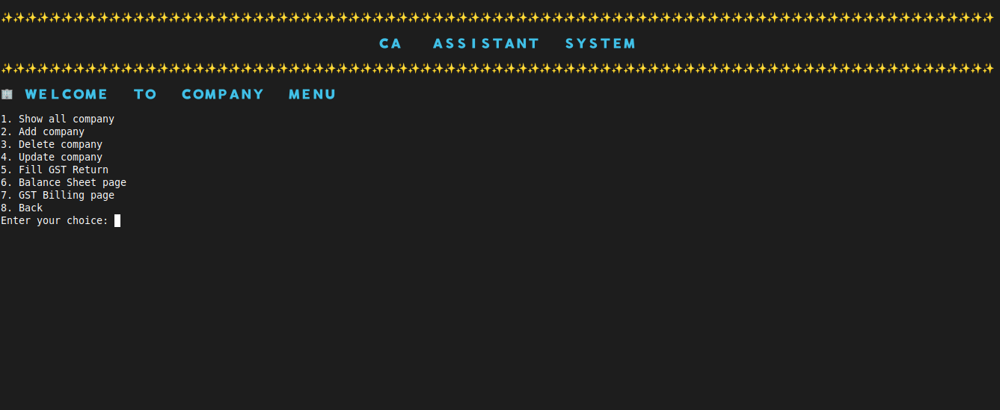
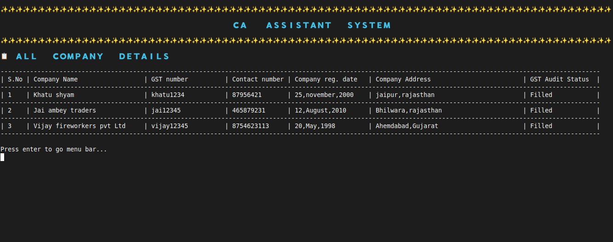
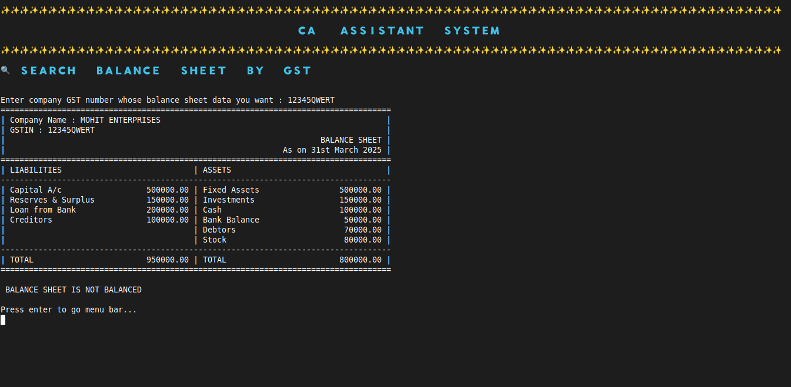
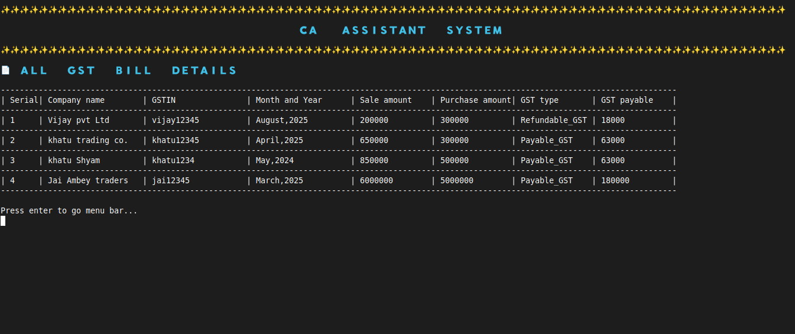
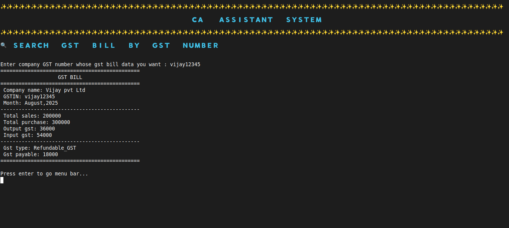
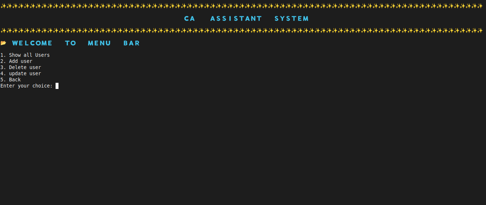
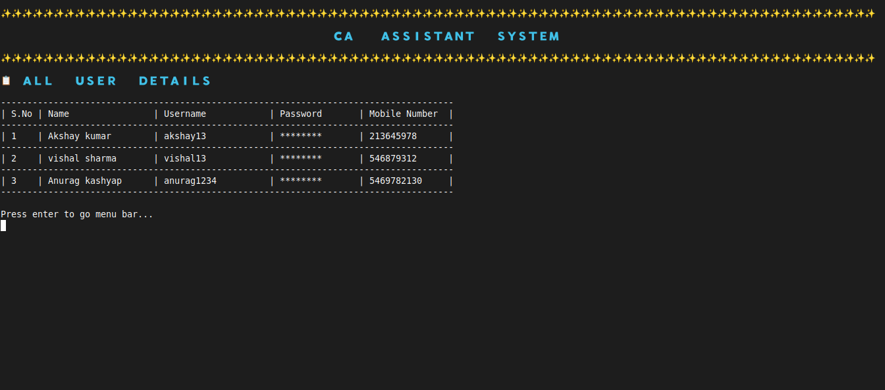

# 💼 CA Assistant System

A command-line based ** Chartered Accountant Assistant System ** built using C++. 
This project helps manage key accounting operations like **Income Tax**, **Balance Sheets**, 
**Client Records**, and **Company Details** using object-oriented programming and file handling.

---

## 📌 Features

- 🔐 **Login Window** with masked password input
- 👥 Add, view, update, and delete **Client & Company records**
- 📄 Manage **Income Tax** details (add/search/update/delete)
- 📊 Manage **Balance Sheets** with GST search and update
- ⚙️ **Automatic Audit Status Update**:
  - When Income Tax is filled or GST Return is submitted,
    the audit status is automatically updated from `Not Filled` to `Filled`
- 📁 File-based data persistence using `fstream`
- 🧱 Modular class-based structure

---

## 🛠️ Tech Stack

- **Language:** C++  
- **Concepts Used:** OOP (Object-Oriented Programming), File Handling, Terminal I/O  
- **Platform:** Linux Terminal

---

## 📷 Screenshots

### 🔐 Login Screen

### 🧭 Main Menu screen

### 👥 Client screens

### 👥 Company screens

### 👥 CA staff/user screens

---

